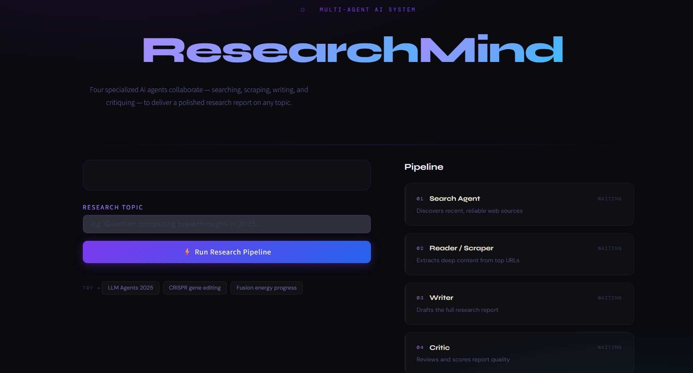

# 🔬 ResearchMind – Multi-Agent AI Research Assistant

ResearchMind is a **production-style multi-agent AI system** designed to perform **autonomous research workflows** on any topic.

Unlike traditional AI applications that rely on a single LLM response, ResearchMind simulates a **team of intelligent agents**, each responsible for a specific task in the research pipeline. These agents collaborate to search the web, extract meaningful information, generate structured reports, and critically evaluate the output — mimicking how real-world researchers work.

This project demonstrates **Agentic AI architecture**, combining **tool usage, reasoning, orchestration, and structured output generation** using modern frameworks like LangChain and LLM APIs.

It is not just a chatbot — it is a **mini research automation system**.

---

## 🚀 Key Features

- 🧠 **Agent-Based Architecture**
  - Multiple specialized agents working collaboratively

- 🔍 **Search Agent**
  - Uses Tavily API to fetch recent and relevant web data

- 📖 **Reader Agent**
  - Scrapes and cleans content from real-world URLs

- ✍️ **Writer Agent**
  - Generates structured, professional research reports

- 🧠 **Critic Agent**
  - Reviews and scores the report with actionable feedback

- ⚡ **Smart Fallback Handling**
  - Uses search snippets if scraping fails (anti-bot, paywalls)

- 🎨 **Modern UI**
  - Built with Streamlit with real-time pipeline visualization

---

## 🧠 System Architecture
User Input (Topic)
↓
🔍 Search Agent
↓
📖 Reader Agent (Scraping)
↓
✍️ Writer Agent (Report Generation)
↓
🧠 Critic Agent (Evaluation)
↓
Final Output (Report + Feedback)

All agents are powered by LLMs and orchestrated using a structured pipeline.

---

## 📂 Project Structure
MULTI_AGENT_SYSTEM/
│
├── agents.py # LLM setup & agent definitions
├── tools.py # Web search & scraping tools
├── pipeline.py # Core multi-agent pipeline logic
├── app.py # Streamlit UI
├── requirements.txt
├── .env # API keys (ignored in Git)
├── venv/ # Virtual environment (ignored)
└── pycache/ # Python cache (ignored)

---

## ⚙️ Tech Stack

- **LangChain** – Agent orchestration
- **Groq API (LLaMA 3.3 70B)** – LLM backend
- **Tavily API** – Real-time web search
- **BeautifulSoup + Requests** – Web scraping
- **Streamlit** – Interactive frontend
- **Python** – Core development

---

## 🔑 Environment Variables

Create a `.env` file in the root directory:
GROQ_API_KEY=your_groq_api_key
TAVILY_API_KEY=your_tavily_api_key
---

## 📦 Installation

bash
# Clone repository
git clone https://github.com/Divyanshumishra21/Multi_Agent_AI_Research_Assistant.git
cd Multi_Agent_AI_Research_Assistant

# Create virtual environment
python -m venv venv

# Activate environment
venv\Scripts\activate      # Windows
# source venv/bin/activate # Mac/Linux

# Install dependencies
pip install -r requirements.txt

# ▶️ Run the Project

## Run via CLI
bash
python pipeline.py
Run Web UI (Recommended)
streamlit run app.py

## 🖥️ How It Works

1. Enter a research topic  

2. The system:
   - Searches for relevant sources  
   - Scrapes content from top URLs  
   - Generates a structured report  
   - Evaluates the report  

3. Output includes:
   - 📄 Research Report  
   - 🧠 Critic Feedback  
   - 🔍 Source Transparency  

---

## 📊 Output Format

### 📄 Research Report
- Introduction  
- Key Findings  
- Conclusion  
- Sources  

### 🧠 Critic Feedback
- Score (X/10)  
- Strengths  
- Areas to Improve  
- Final Verdict  

---

## ⚠️ Limitations

- Some websites block scraping (handled via fallback)  
- Depends on API rate limits (Groq / Tavily)  
- May not always guarantee factual accuracy  

---

## 🔮 Future Improvements

- Multi-source aggregation  
- Vector database integration (RAG)  
- Persistent agent memory  
- Export reports as PDF  
---

## ⭐ Support

If you like this project:

- Star ⭐ the repo  
- Fork 🍴 it  
- Share 🔗 it  

---
## 📸 Project UI

  

